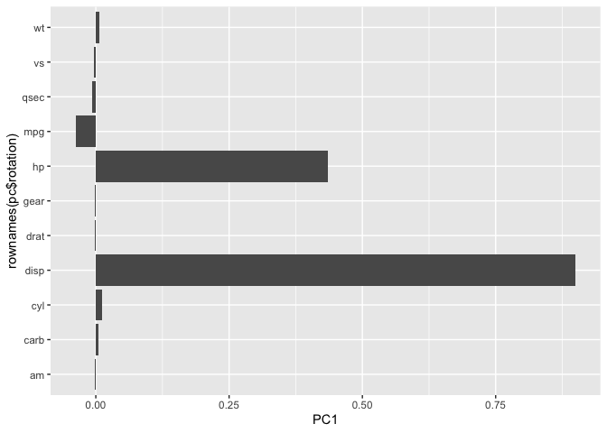
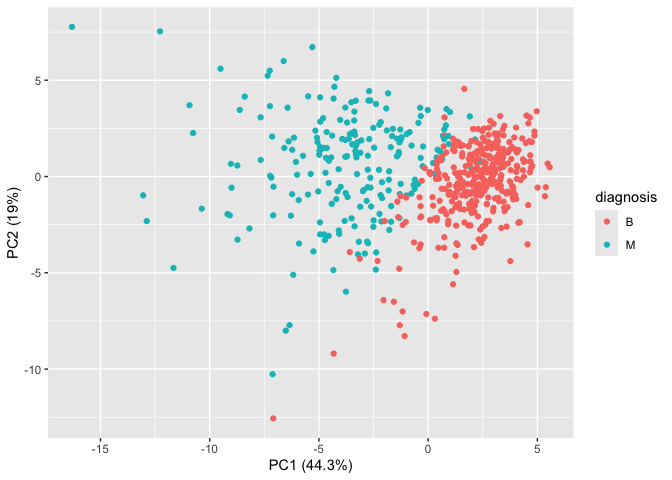
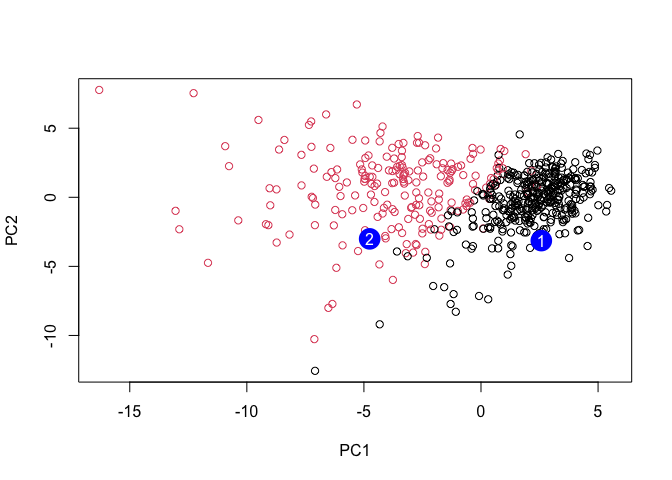

# Class 8: Breast Cancer mini project
Hailey Heirigs (PID: A16962278)

- [Background](#background)
- [Data Import](#data-import)
- [Clustering](#clustering)
- [Principal Component Analysis
  (PCA)](#principal-component-analysis-pca)
  - [The Importance of Data Scaling](#the-importance-of-data-scaling)
  - [PCA of this wisc.data](#pca-of-this-wiscdata)
- [5. Combining Methods](#5-combining-methods)
  - [Clustering on PCA results](#clustering-on-pca-results)
- [7. Prediction](#7-prediction)

## Background

This mini project explores unsupervised learning techniques applied to
the Wisconsin Breast Cancer Diagnostic Data Set, which contains
measuremenst of human breast mass cell nuclei. The project guides the
user through exploratory data analysis, performing and interpreting
Principal Component Analysis (PCA) to reduce the dimensionality of the
data while retaining variance, and applying hierarchical clustering to
better separate benign and malignant cell samples, evaluating the
results using metrics like sensitivity and specificity, and finally
demonstrating how to predict the classification of new samples using the
developed PCA model.

## Data Import

Our data come from the U. of Wisconsin Medical Center

``` r
wisc.df <- read.csv("WisconsinCancer.csv", row.names=1)
```

> Q1. How many patients/samples are in this dataset?

``` r
nrow(wisc.df)
```

    [1] 569

> Q2. How many of the observations have a malignant diagnosis?

``` r
table(wisc.df$diagnosis)
```


      B   M 
    357 212 

``` r
sum(wisc.df$diagnosis == "M")
```

    [1] 212

> Q3. How many variables/features in the data are suffixed with \_mean?

``` r
colnames(wisc.df)
```

     [1] "diagnosis"               "radius_mean"            
     [3] "texture_mean"            "perimeter_mean"         
     [5] "area_mean"               "smoothness_mean"        
     [7] "compactness_mean"        "concavity_mean"         
     [9] "concave.points_mean"     "symmetry_mean"          
    [11] "fractal_dimension_mean"  "radius_se"              
    [13] "texture_se"              "perimeter_se"           
    [15] "area_se"                 "smoothness_se"          
    [17] "compactness_se"          "concavity_se"           
    [19] "concave.points_se"       "symmetry_se"            
    [21] "fractal_dimension_se"    "radius_worst"           
    [23] "texture_worst"           "perimeter_worst"        
    [25] "area_worst"              "smoothness_worst"       
    [27] "compactness_worst"       "concavity_worst"        
    [29] "concave.points_worst"    "symmetry_worst"         
    [31] "fractal_dimension_worst"

``` r
length( grep("mean", colnames(wisc.df), value = T) )
```

    [1] 10

There is a diagnosis column that is the clinician consensus that I want
to exclude from any further analysis. We will come back later and
compare our results to this diagnosis.

``` r
diagnosis <- as.factor(wisc.df$diagnosis)
head(diagnosis)
```

    [1] M M M M M M
    Levels: B M

Now we can remove it from the `wisc.df`

``` r
wisc.data <- wisc.df[,-1]
```

## Clustering

``` r
kmeans(wisc.data, centers = 2)
```

    K-means clustering with 2 clusters of sizes 438, 131

    Cluster means:
      radius_mean texture_mean perimeter_mean area_mean smoothness_mean
    1    12.55630     18.57037       81.12347  496.0619       0.0948845
    2    19.37992     21.69458      128.23130 1185.9298       0.1012946
      compactness_mean concavity_mean concave.points_mean symmetry_mean
    1       0.09109982     0.06243776          0.03343254     0.1780580
    2       0.14861298     0.17693947          0.10069878     0.1915397
      fractal_dimension_mean radius_se texture_se perimeter_se  area_se
    1             0.06345402 0.3041909   1.215153     2.152881 23.78529
    2             0.06060290 0.7428038   1.222538     5.250580 95.67817
      smoothness_se compactness_se concavity_se concave.points_se symmetry_se
    1   0.007173263     0.02347469   0.02874551        0.01063632  0.02061358
    2   0.006598687     0.03217669   0.04241977        0.01567398  0.02030397
      fractal_dimension_se radius_worst texture_worst perimeter_worst area_worst
    1          0.003747503     14.04390      24.70954        91.93751   619.6479
    2          0.003953389     23.70947      28.91267       158.49618  1753.0229
      smoothness_worst compactness_worst concavity_worst concave.points_worst
    1        0.1299591         0.2233118       0.2192149           0.09132984
    2        0.1404247         0.3577577       0.4493061           0.19243107
      symmetry_worst fractal_dimension_worst
    1      0.2835537              0.08328194
    2      0.3118817              0.08616550

    Clustering vector:
       842302    842517  84300903  84348301  84358402    843786    844359  84458202 
            2         2         2         1         2         1         2         1 
       844981  84501001    845636  84610002    846226    846381  84667401  84799002 
            1         1         1         2         2         1         1         1 
       848406  84862001    849014   8510426   8510653   8510824   8511133    851509 
            1         2         2         1         1         1         1         2 
       852552    852631    852763    852781    852973    853201    853401    853612 
            2         2         1         2         2         2         2         1 
     85382601    854002    854039    854253    854268    854941    855133    855138 
            2         2         2         2         1         1         1         1 
       855167    855563    855625    856106  85638502    857010  85713702     85715 
            1         1         2         1         1         2         1         1 
       857155    857156    857343    857373    857374    857392    857438  85759902 
            1         1         1         1         1         2         1         1 
       857637    857793    857810    858477    858970    858981    858986    859196 
            2         1         1         1         1         1         1         1 
     85922302    859283    859464    859465    859471    859487    859575    859711 
            1         1         1         1         1         1         2         1 
       859717    859983   8610175   8610404   8610629   8610637   8610862   8610908 
            2         1         1         2         1         2         2         1 
       861103   8611161   8611555   8611792   8612080   8612399  86135501  86135502 
            1         1         2         2         1         2         1         2 
       861597    861598    861648    861799    861853    862009    862028     86208 
            1         1         1         1         1         1         1         2 
        86211    862261    862485    862548    862717    862722    862965    862980 
            1         1         1         1         1         1         1         1 
       862989    863030    863031    863270     86355    864018    864033     86408 
            1         1         1         1         2         1         1         1 
        86409    864292    864496    864685    864726    864729    864877    865128 
            1         1         1         1         1         1         2         2 
       865137     86517    865423    865432    865468     86561    866083    866203 
            1         2         2         1         1         1         1         2 
       866458    866674    866714      8670  86730502    867387    867739    868202 
            1         2         1         1         1         1         2         1 
       868223    868682    868826    868871    868999    869104    869218    869224 
            1         1         1         1         1         2         1         1 
       869254    869476    869691  86973701  86973702    869931 871001501 871001502 
            1         1         1         1         1         1         1         1 
      8710441     87106   8711002   8711003   8711202   8711216    871122    871149 
            1         1         1         1         2         1         1         1 
      8711561   8711803    871201   8712064   8712289   8712291     87127   8712729 
            1         2         2         1         2         1         1         2 
      8712766   8712853  87139402     87163     87164    871641    871642    872113 
            2         1         1         1         1         1         1         1 
       872608  87281702    873357    873586    873592    873593    873701    873843 
            1         1         1         1         2         2         2         1 
       873885    874158    874217    874373    874662    874839    874858    875093 
            1         1         2         1         1         1         1         1 
       875099    875263  87556202    875878    875938    877159    877486    877500 
            1         1         1         1         1         2         2         1 
       877501    877989    878796     87880     87930    879523    879804    879830 
            1         2         2         1         1         1         1         2 
      8810158   8810436 881046502   8810528   8810703 881094802   8810955   8810987 
            1         1         2         1         2         1         1         1 
      8811523   8811779   8811842  88119002   8812816   8812818   8812844   8812877 
            1         1         2         2         1         1         1         1 
      8813129  88143502  88147101  88147102  88147202    881861    881972  88199202 
            1         1         1         1         1         1         2         1 
     88203002  88206102    882488  88249602  88299702    883263    883270  88330202 
            1         2         1         1         2         2         1         2 
     88350402    883539    883852  88411702    884180    884437    884448    884626 
            1         1         1         1         2         1         1         1 
     88466802    884689    884948  88518501    885429   8860702    886226    886452 
            1         1         2         1         2         2         2         1 
     88649001    886776    887181  88725602    887549    888264    888570    889403 
            2         1         2         1         2         2         2         1 
       889719  88995002   8910251   8910499   8910506   8910720   8910721   8910748 
            2         2         1         1         1         1         1         1 
      8910988   8910996   8911163   8911164   8911230   8911670   8911800   8911834 
            2         1         2         1         1         2         1         1 
      8912049   8912055     89122   8912280   8912284   8912521   8912909      8913 
            2         1         2         1         1         1         1         1 
      8913049  89143601  89143602      8915    891670    891703    891716    891923 
            1         1         1         1         1         1         1         1 
       891936    892189    892214    892399    892438    892604  89263202    892657 
            1         1         1         1         2         1         2         1 
        89296    893061     89344     89346    893526    893548    893783  89382601 
            1         1         1         1         1         1         1         1 
     89382602    893988    894047    894089    894090    894326    894329    894335 
            1         1         1         1         1         2         1         1 
       894604    894618    894855    895100  89511501  89511502     89524    895299 
            1         2         1         2         1         1         1         1 
      8953902    895633    896839    896864    897132    897137    897374  89742801 
            1         1         1         1         1         1         1         2 
       897604    897630    897880     89812     89813    898143     89827    898431 
            1         2         1         2         1         1         1         2 
     89864002    898677    898678     89869    898690    899147    899187    899667 
            1         1         1         1         1         1         1         1 
       899987   9010018    901011   9010258   9010259    901028   9010333 901034301 
            2         1         1         1         1         1         1         1 
    901034302    901041   9010598   9010872   9010877    901088   9011494   9011495 
            1         1         1         1         1         2         2         1 
      9011971   9012000   9012315   9012568   9012795    901288   9013005    901303 
            2         2         1         1         2         2         1         1 
       901315   9013579   9013594   9013838    901549    901836     90250     90251 
            1         1         1         1         1         1         1         1 
       902727     90291    902975    902976    903011     90312  90317302    903483 
            1         1         1         1         1         2         1         1 
       903507    903516    903554    903811  90401601  90401602    904302    904357 
            2         2         1         1         1         1         1         1 
     90439701    904647    904689      9047    904969    904971    905189    905190 
            2         1         1         1         1         1         1         1 
     90524101    905501    905502    905520    905539    905557    905680    905686 
            2         1         1         1         1         1         1         1 
       905978  90602302    906024    906290    906539    906564    906616    906878 
            1         2         1         1         1         1         1         1 
       907145    907367    907409     90745  90769601  90769602    907914    907915 
            1         1         1         1         1         1         1         1 
       908194    908445    908469    908489    908916    909220    909231    909410 
            2         2         1         1         1         1         1         1 
       909411    909445  90944601    909777   9110127   9110720   9110732   9110944 
            1         2         1         1         2         1         2         1 
       911150 911157302   9111596   9111805   9111843    911201    911202   9112085 
            1         2         1         2         1         1         1         1 
      9112366   9112367   9112594   9112712 911296201 911296202   9113156 911320501 
            1         1         1         1         2         2         1         1 
    911320502   9113239   9113455   9113514   9113538    911366   9113778   9113816 
            1         1         1         1         2         1         1         1 
       911384   9113846    911391    911408    911654    911673    911685    911916 
            1         1         1         1         1         1         1         1 
       912193     91227    912519    912558    912600    913063    913102    913505 
            1         1         1         1         1         1         1         2 
       913512    913535  91376701  91376702    914062    914101    914102    914333 
            1         1         1         2         2         1         1         1 
       914366    914580    914769     91485    914862     91504     91505    915143 
            1         1         2         2         1         1         1         2 
       915186    915276  91544001  91544002    915452    915460     91550    915664 
            1         1         1         1         1         1         1         1 
       915691    915940  91594602    916221    916799    916838    917062    917080 
            1         1         1         1         2         2         1         1 
       917092  91762702     91789    917896    917897     91805  91813701  91813702 
            1         2         1         1         1         1         1         1 
       918192    918465     91858  91903901  91903902  91930402    919537    919555 
            1         1         1         1         1         2         1         2 
     91979701    919812    921092    921362    921385    921386    921644    922296 
            1         1         1         1         1         1         1         1 
       922297    922576    922577    922840    923169    923465    923748    923780 
            1         1         1         1         1         1         1         1 
       924084    924342    924632    924934    924964    925236    925277    925291 
            1         1         1         1         1         1         1         1 
       925292    925311    925622    926125    926424    926682    926954    927241 
            1         1         1         2         2         2         1         2 
        92751 
            1 

    Within cluster sum of squares by cluster:
    [1] 28559677 49383423
     (between_SS / total_SS =  69.6 %)

    Available components:

    [1] "cluster"      "centers"      "totss"        "withinss"     "tot.withinss"
    [6] "betweenss"    "size"         "iter"         "ifault"      

let’s try `hclust`

``` r
hc <- hclust(dist(wisc.data))
plot(hc)
```


We can extract clusters from this rather poor dendrogram/tree with the
`cutree()`

``` r
grps <- cutree(hc, k=2)
```

How many individuals in each cluster?

``` r
table(grps)
```

    grps
      1   2 
    549  20 

``` r
table(diagnosis)
```

    diagnosis
      B   M 
    357 212 

We can generate a cross-table that compares our cluster `grps` vector
with our `diagnosis` vector values.

``` r
table(diagnosis, grps)
```

             grps
    diagnosis   1   2
            B 357   0
            M 192  20

## Principal Component Analysis (PCA)

### The Importance of Data Scaling

The main function for PCA in base R is `prcomp()` it has a default input
parameter of `scale=FALSE`.

``` r
#prcomp()
head(mtcars)
```

                       mpg cyl disp  hp drat    wt  qsec vs am gear carb
    Mazda RX4         21.0   6  160 110 3.90 2.620 16.46  0  1    4    4
    Mazda RX4 Wag     21.0   6  160 110 3.90 2.875 17.02  0  1    4    4
    Datsun 710        22.8   4  108  93 3.85 2.320 18.61  1  1    4    1
    Hornet 4 Drive    21.4   6  258 110 3.08 3.215 19.44  1  0    3    1
    Hornet Sportabout 18.7   8  360 175 3.15 3.440 17.02  0  0    3    2
    Valiant           18.1   6  225 105 2.76 3.460 20.22  1  0    3    1

We could do a PCA of this data as is and it could be mis-leading.

``` r
pc <- prcomp(mtcars)
biplot(pc)
```


Let’s look at the mean values of each column and their standard
deviation.

``` r
colMeans(mtcars)
```

           mpg        cyl       disp         hp       drat         wt       qsec 
     20.090625   6.187500 230.721875 146.687500   3.596563   3.217250  17.848750 
            vs         am       gear       carb 
      0.437500   0.406250   3.687500   2.812500 

``` r
apply(mtcars, 2, sd)
```

            mpg         cyl        disp          hp        drat          wt 
      6.0269481   1.7859216 123.9386938  68.5628685   0.5346787   0.9784574 
           qsec          vs          am        gear        carb 
      1.7869432   0.5040161   0.4989909   0.7378041   1.6152000 

We can “scale” this data before PCA to get a much better represenation
and analysis of all the columns.

``` r
mtscale <- scale(mtcars)
```

``` r
round(colMeans(mtscale))
```

     mpg  cyl disp   hp drat   wt qsec   vs   am gear carb 
       0    0    0    0    0    0    0    0    0    0    0 

``` r
apply(mtscale, 2, sd)
```

     mpg  cyl disp   hp drat   wt qsec   vs   am gear carb 
       1    1    1    1    1    1    1    1    1    1    1 

``` r
pc.scale <- prcomp(mtscale)
```

We can look at the two main results figures from PCA - the “PC plot”
(a.k.a. score plot, orientation plot, or PC1 vs PC2 plot). The “loadings
plot” says how the original variables contribute to the new PCs.

A loadings plot of the unscaled PCA results

``` r
library(ggplot2)

ggplot(pc$rotation) +
  aes(PC1, rownames(pc$rotation)) +
  geom_col()
```



Loadings plot of the scaled data.

``` r
ggplot(pc.scale$rotation) +
  aes(PC1, rownames(pc$rotation)) +
  geom_col()
```


PC plot of scaled PCA results

``` r
library(ggrepel)

ggplot(pc.scale$x) + 
  aes(PC1, PC2, label=rownames(pc.scale$x)) + 
  geom_point() + 
  geom_text()
```


> **Key point**: In general, we will set `scale=TRUE` when we do PCA.
> This is not the default but probably should be…

We can check the SD and mean of the different columns in `wisc.data` to
see if we need to scale - hint we do!

### PCA of this wisc.data

``` r
wisc.pr <- prcomp(wisc.data, scale=TRUE)
```

To see how well this PCA data is doing in terms of capturing the
variance (or spread) in the data, we can use the `summary()` function.

``` r
summary(wisc.pr)
```

    Importance of components:
                              PC1    PC2     PC3     PC4     PC5     PC6     PC7
    Standard deviation     3.6444 2.3857 1.67867 1.40735 1.28403 1.09880 0.82172
    Proportion of Variance 0.4427 0.1897 0.09393 0.06602 0.05496 0.04025 0.02251
    Cumulative Proportion  0.4427 0.6324 0.72636 0.79239 0.84734 0.88759 0.91010
                               PC8    PC9    PC10   PC11    PC12    PC13    PC14
    Standard deviation     0.69037 0.6457 0.59219 0.5421 0.51104 0.49128 0.39624
    Proportion of Variance 0.01589 0.0139 0.01169 0.0098 0.00871 0.00805 0.00523
    Cumulative Proportion  0.92598 0.9399 0.95157 0.9614 0.97007 0.97812 0.98335
                              PC15    PC16    PC17    PC18    PC19    PC20   PC21
    Standard deviation     0.30681 0.28260 0.24372 0.22939 0.22244 0.17652 0.1731
    Proportion of Variance 0.00314 0.00266 0.00198 0.00175 0.00165 0.00104 0.0010
    Cumulative Proportion  0.98649 0.98915 0.99113 0.99288 0.99453 0.99557 0.9966
                              PC22    PC23   PC24    PC25    PC26    PC27    PC28
    Standard deviation     0.16565 0.15602 0.1344 0.12442 0.09043 0.08307 0.03987
    Proportion of Variance 0.00091 0.00081 0.0006 0.00052 0.00027 0.00023 0.00005
    Cumulative Proportion  0.99749 0.99830 0.9989 0.99942 0.99969 0.99992 0.99997
                              PC29    PC30
    Standard deviation     0.02736 0.01153
    Proportion of Variance 0.00002 0.00000
    Cumulative Proportion  1.00000 1.00000

Let’s make the main PC1 vs PC2

``` r
ggplot(wisc.pr$x) + 
  aes(PC1, PC2, col=diagnosis) + 
  geom_point() +
  xlab("PC1 (44.3%)") + 
  ylab("PC2 (19%)")
```



> Q10. Please answer up to this Q10… ;

> Q4. From your results, what proportion of the original variance is
> captured by the first principal components (PC1)?

\[44.3%\]

> Q5. How many principal components (PCs) are required to describe at
> least 70% of the original variance in the data?

3 principal components are required to describe at least 70% of the
original variance in the data.

> Q6. How many principal components (PCs) are required to describe at
> least 90% of the original variance in the data?

7 principal components are required to describe at least 70% of the
original variance in the data.

> Q7. What stands out to you about this plot? Is it easy or difficult to
> understand? Why?

The difference diagnosises are grouped very visibly by color and their
distinct groupings stand out to me. It is easy to understand and see,
due to being able to see where they fall on the scatter plot.

> Q8. Generate a similar plot for principal components 1 and 3. What do
> you notice about these plots?

``` r
ggplot(wisc.pr$x) + 
  aes(PC1, PC3, col=diagnosis) + 
  geom_point() +
  xlab("PC1 (44.3%)") + 
  ylab("PC2 (9.4%)")
```


After generating a similar plot, I notice that the diagnosises of benign
or malignant are still grouped together, but are at a lower percentage
on the y-axis. This is because the PC3 proportion of variance is lower,
and so the shift is to be expected. I also notice slightly more overlap
between the two diagnosises, in comparison to the PC1 and PC2 plot from
before.

> Q9. For the first principal component, what is the component of the
> loading vector (i.e. wisc.pr\$rotation\[,1\]) for the feature
> concave.points_mean?

``` r
pr.var <- wisc.pr$sdev^2
head(pr.var)
```

    [1] 13.281608  5.691355  2.817949  1.980640  1.648731  1.207357

``` r
pve <- pr.var / sum(pr.var)

plot(pve, xlab = "Principal Component", 
     ylab = "Proportion of Variance Explained", 
     ylim = c(0, 1), type = "o")
```


The component of the loading vector `wisc.pr$rotation[,1]` for the
feature of `concave.points_mean` is -0.26085376.

``` r
wisc.pr$rotation[,1]
```

                radius_mean            texture_mean          perimeter_mean 
                -0.21890244             -0.10372458             -0.22753729 
                  area_mean         smoothness_mean        compactness_mean 
                -0.22099499             -0.14258969             -0.23928535 
             concavity_mean     concave.points_mean           symmetry_mean 
                -0.25840048             -0.26085376             -0.13816696 
     fractal_dimension_mean               radius_se              texture_se 
                -0.06436335             -0.20597878             -0.01742803 
               perimeter_se                 area_se           smoothness_se 
                -0.21132592             -0.20286964             -0.01453145 
             compactness_se            concavity_se       concave.points_se 
                -0.17039345             -0.15358979             -0.18341740 
                symmetry_se    fractal_dimension_se            radius_worst 
                -0.04249842             -0.10256832             -0.22799663 
              texture_worst         perimeter_worst              area_worst 
                -0.10446933             -0.23663968             -0.22487053 
           smoothness_worst       compactness_worst         concavity_worst 
                -0.12795256             -0.21009588             -0.22876753 
       concave.points_worst          symmetry_worst fractal_dimension_worst 
                -0.25088597             -0.12290456             -0.13178394 

> Q10. What is the minimum number of principal components required to
> explain 80% of the variance of the data?

The minimum number of principal components required to explain 80% of
the variance of the data is 5 components combined.

## 5. Combining Methods

We can take our PCA results and use them as a basis set for other
analysis such as clustering.

### Clustering on PCA results

``` r
wisc.pr.hclust <- hclust( dist(wisc.pr$x[,1:2]), method="ward.D2" )
plot(wisc.pr.hclust)
```


We can “cut” this tree to yield our clusters (groups):

``` r
pc.grps <- cutree(wisc.pr.hclust, k=2)
table(pc.grps)
```

    pc.grps
      1   2 
    195 374 

How do my cluster grps compare to the expert diagnosis from

``` r
table(diagnosis, pc.grps)
```

             pc.grps
    diagnosis   1   2
            B  18 339
            M 177  35

``` r
table(diagnosis)
```

    diagnosis
      B   M 
    357 212 

> Q15. How well does the newly created model with four clusters separate
> out the two diagnoses?

The newly created model with four clusters separates the two diagnoses
in a cleaner way, but has the potential to be hard to read; whereas a
model that separates via two clusters could be more distinct and helpful
in visualization.

> Q16. How well do the k-means and hierarchical clustering models you
> created in previous sections (i.e. before PCA) do in terms of
> separating the diagnoses? Again, use the table() function to compare
> the output of each model (wisc.km\$cluster and wisc.hclust.clusters)
> with the vector containing the actual diagnoses.

They did really badly. We do much better after PCA - the new PCA
variables (what we call a basis set) gives us much better separation of
M and B.

## 7. Prediction

We can use our PCA model for analysis of new “unseen” data. In this case
from U. Mich.

``` r
url <- "https://tinyurl.com/new-samples-CSV"
new <- read.csv(url)
npc <- predict(wisc.pr, newdata=new)
npc
```

               PC1       PC2        PC3        PC4       PC5        PC6        PC7
    [1,]  2.576616 -3.135913  1.3990492 -0.7631950  2.781648 -0.8150185 -0.3959098
    [2,] -4.754928 -3.009033 -0.1660946 -0.6052952 -1.140698 -1.2189945  0.8193031
                PC8       PC9       PC10      PC11      PC12      PC13     PC14
    [1,] -0.2307350 0.1029569 -0.9272861 0.3411457  0.375921 0.1610764 1.187882
    [2,] -0.3307423 0.5281896 -0.4855301 0.7173233 -1.185917 0.5893856 0.303029
              PC15       PC16        PC17        PC18        PC19       PC20
    [1,] 0.3216974 -0.1743616 -0.07875393 -0.11207028 -0.08802955 -0.2495216
    [2,] 0.1299153  0.1448061 -0.40509706  0.06565549  0.25591230 -0.4289500
               PC21       PC22       PC23       PC24        PC25         PC26
    [1,]  0.1228233 0.09358453 0.08347651  0.1223396  0.02124121  0.078884581
    [2,] -0.1224776 0.01732146 0.06316631 -0.2338618 -0.20755948 -0.009833238
                 PC27        PC28         PC29         PC30
    [1,]  0.220199544 -0.02946023 -0.015620933  0.005269029
    [2,] -0.001134152  0.09638361  0.002795349 -0.019015820

``` r
plot(wisc.pr$x[,1:2], col=diagnosis)
points(npc[,1], npc[,2], col="blue", pch=16, cex=3)
text(npc[,1], npc[,2], c(1,2), col="white")
```



> Q18. Which of these new patients should we prioritize for follow up
> based on your results?

Patient 2 for sure.

**answer questions 1-10, 15, 16, 18 for homework.**
