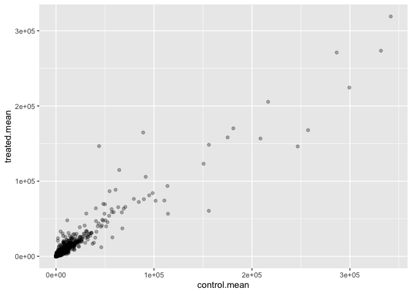
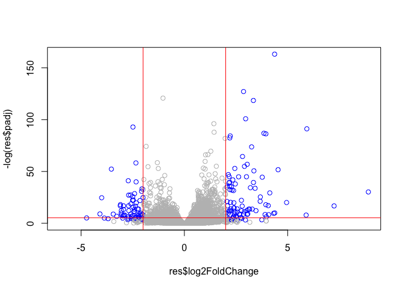
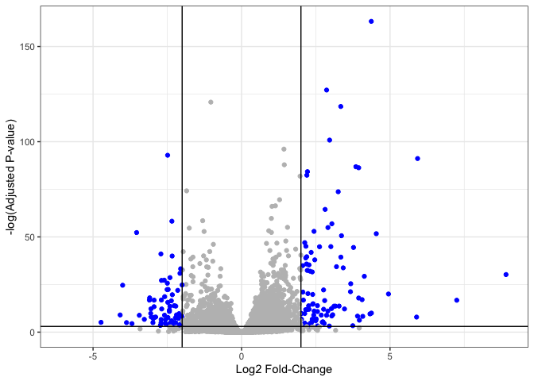

# Class 13: RNASeq Analysis
Hailey Heirigs (PID: A16962278)

- [Background](#background)
- [Toy differential gene expression](#toy-differential-gene-expression)
- [DESeq2 analysis](#deseq2-analysis)
- [Result figure: Volcano Plots](#result-figure-volcano-plots)
- [We need to add gene-annotation](#we-need-to-add-gene-annotation)
  - [Pathway Analysis](#pathway-analysis)
- [Pathway Analysis](#pathway-analysis-1)

# Background

Today we will analyze some RNA Sequencing data on the effects of a
common steroid drug on airway cell lines.

There are two main inputs for this analysis:

- `countData`: counts for genes in rows with experiments in the column
- `colData`: or metadata that tells us about the design of the
  experiment (i.e. what is in the columns of `countData`)

``` r
counts <- read.csv("airway_scaledcounts.csv", row.names=1)
metadata <-  read.csv("airway_metadata.csv")
```

> Q1. How many genes are in this dataset?

``` r
head(counts)
```

                    SRR1039508 SRR1039509 SRR1039512 SRR1039513 SRR1039516
    ENSG00000000003        723        486        904        445       1170
    ENSG00000000005          0          0          0          0          0
    ENSG00000000419        467        523        616        371        582
    ENSG00000000457        347        258        364        237        318
    ENSG00000000460         96         81         73         66        118
    ENSG00000000938          0          0          1          0          2
                    SRR1039517 SRR1039520 SRR1039521
    ENSG00000000003       1097        806        604
    ENSG00000000005          0          0          0
    ENSG00000000419        781        417        509
    ENSG00000000457        447        330        324
    ENSG00000000460         94        102         74
    ENSG00000000938          0          0          0

``` r
nrow(counts)
```

    [1] 38694

> Q2. How many ‘control’ cell lines do we have?

``` r
head(metadata)
```

              id     dex celltype     geo_id
    1 SRR1039508 control   N61311 GSM1275862
    2 SRR1039509 treated   N61311 GSM1275863
    3 SRR1039512 control  N052611 GSM1275866
    4 SRR1039513 treated  N052611 GSM1275867
    5 SRR1039516 control  N080611 GSM1275870
    6 SRR1039517 treated  N080611 GSM1275871

``` r
metadata$dex
```

    [1] "control" "treated" "control" "treated" "control" "treated" "control"
    [8] "treated"

``` r
table(metadata$dex)
```


    control treated 
          4       4 

``` r
sum(metadata$dex == "control")
```

    [1] 4

# Toy differential gene expression

Let’s try finding the average or mean of the “control” and “treated”
columns and see if they differ.

- 1.  First we need to find all “control” columns
- 2.  Extract just the “control” values for each gene
- 3.  Calculate the `mean()` for each gene “control” values

``` r
metadata
```

              id     dex celltype     geo_id
    1 SRR1039508 control   N61311 GSM1275862
    2 SRR1039509 treated   N61311 GSM1275863
    3 SRR1039512 control  N052611 GSM1275866
    4 SRR1039513 treated  N052611 GSM1275867
    5 SRR1039516 control  N080611 GSM1275870
    6 SRR1039517 treated  N080611 GSM1275871
    7 SRR1039520 control  N061011 GSM1275874
    8 SRR1039521 treated  N061011 GSM1275875

``` r
colnames(counts)
```

    [1] "SRR1039508" "SRR1039509" "SRR1039512" "SRR1039513" "SRR1039516"
    [6] "SRR1039517" "SRR1039520" "SRR1039521"

``` r
all(colnames(counts) == metadata$id)
```

    [1] TRUE

The \$dex column tells me whether we have “control” or “treated”

``` r
control.inds <- metadata$dex == "control"
```

Extract just the “control” values for all genes

``` r
control.counts <- counts[,control.inds]
```

Calculate the mean value for each gene in these “control” columns

``` r
control.mean <- rowMeans(control.counts)
```

> Q3. Do the same for “treated” to get a `treated.mean`

``` r
treated.mean <- rowMeans(counts[, metadata$dex == "treated"])
```

> Q4. Make a plot of `control.mean` vs `treated.mean`

Let’s store our mean values together in data.frame for easier
book-keeping

``` r
meancounts <- data.frame(control.mean, treated.mean)
head(meancounts)
```

                    control.mean treated.mean
    ENSG00000000003       900.75       658.00
    ENSG00000000005         0.00         0.00
    ENSG00000000419       520.50       546.00
    ENSG00000000457       339.75       316.50
    ENSG00000000460        97.25        78.75
    ENSG00000000938         0.75         0.00

Second gene has no effect either.

``` r
plot(meancounts)
```


``` r
library(ggplot2)

ggplot(meancounts) + 
  aes(control.mean, treated.mean) +
  geom_point(alpha=0.3)
```



Only some are very highly expressed in both treated and controlled, and
the data is heavily skewed, so we want to transform it.

We totally need to log transform this data as it is so heavily skewed!

Now plot this on a log-log scale:

``` r
ggplot(meancounts) + aes(control.mean, treated.mean) +
  geom_point(alpha=0.3) + theme_bw() +
  scale_x_log10() + scale_y_log10()
```

    Warning in scale_x_log10(): log-10 transformation introduced infinite values.

    Warning in scale_y_log10(): log-10 transformation introduced infinite values.


``` r
# TREATED/CONTROL

log2(20/20)
```

    [1] 0

``` r
log2(40/20)
```

    [1] 1

``` r
log2(10/20)
```

    [1] -1

anything with minus sign, is facing down anything with plus sign, is
upright

A common “rule-of-thumb” is to focus on genes with a log2 “fold-change”
of +2 as so-called UP REGULATED and -2 as DOWN REGULATED.

``` r
log2(80/20)
```

    [1] 2

Let’s add a log2 fold-change value to our `meancounts` data.frame

``` r
meancounts$log2fc <- log2(meancounts$treated.mean/
                            meancounts$control.mean)

head(meancounts)
```

                    control.mean treated.mean      log2fc
    ENSG00000000003       900.75       658.00 -0.45303916
    ENSG00000000005         0.00         0.00         NaN
    ENSG00000000419       520.50       546.00  0.06900279
    ENSG00000000457       339.75       316.50 -0.10226805
    ENSG00000000460        97.25        78.75 -0.30441833
    ENSG00000000938         0.75         0.00        -Inf

> Q. Remove any “zero count” genes from our dataset for further analysis

``` r
to.keep <- rowSums( meancounts[,1:2] == 0 ) == 0 
sum(to.keep)
```

    [1] 21817

``` r
mycounts <- meancounts[to.keep,]
head(mycounts)
```

                    control.mean treated.mean      log2fc
    ENSG00000000003       900.75       658.00 -0.45303916
    ENSG00000000419       520.50       546.00  0.06900279
    ENSG00000000457       339.75       316.50 -0.10226805
    ENSG00000000460        97.25        78.75 -0.30441833
    ENSG00000000971      5219.00      6687.50  0.35769358
    ENSG00000001036      2327.00      1785.75 -0.38194109

> Q. How many genes are “up” regulated at a log2fc threshold of +2?

``` r
sum( mycounts$log2fc >= 2 )
```

    [1] 314

> Q. How many genes are “down” regulated at a log2fc threshold of -2?

``` r
sum( mycounts$log2fc <= -2 )
```

    [1] 485

*but we are missing stats*

# DESeq2 analysis

Let’s do this properly and consider the stats - are the differences in
the means significant?

We will use DESeq2 to do this:

``` r
library(DESeq2)
```

The first function we will use from this package sets up the input in
the particular format that DESeq2 wants:

``` r
dds <- DESeqDataSetFromMatrix(countData = counts,
                       colData = metadata, 
                        design = ~dex)
```

    converting counts to integer mode

    Warning in DESeqDataSet(se, design = design, ignoreRank): some variables in
    design formula are characters, converting to factors

We can now run our DESeq analysis

``` r
dds <- DESeq(dds)
```

    estimating size factors

    estimating dispersions

    gene-wise dispersion estimates

    mean-dispersion relationship

    final dispersion estimates

    fitting model and testing

``` r
res <- results(dds)
```

Peak at results

``` r
head(res)
```

    log2 fold change (MLE): dex treated vs control 
    Wald test p-value: dex treated vs control 
    DataFrame with 6 rows and 6 columns
                      baseMean log2FoldChange     lfcSE      stat    pvalue
                     <numeric>      <numeric> <numeric> <numeric> <numeric>
    ENSG00000000003 747.194195     -0.3507030  0.168246 -2.084470 0.0371175
    ENSG00000000005   0.000000             NA        NA        NA        NA
    ENSG00000000419 520.134160      0.2061078  0.101059  2.039475 0.0414026
    ENSG00000000457 322.664844      0.0245269  0.145145  0.168982 0.8658106
    ENSG00000000460  87.682625     -0.1471420  0.257007 -0.572521 0.5669691
    ENSG00000000938   0.319167     -1.7322890  3.493601 -0.495846 0.6200029
                         padj
                    <numeric>
    ENSG00000000003  0.163035
    ENSG00000000005        NA
    ENSG00000000419  0.176032
    ENSG00000000457  0.961694
    ENSG00000000460  0.815849
    ENSG00000000938        NA

# Result figure: Volcano Plots

Plot of the Log2FC vs P-value

``` r
plot(res$log2FoldChange, res$padj)
```


This P-value data is again heavily skewed so lets log transform it

``` r
plot(res$log2FoldChange, log(res$padj))
```


``` r
log(0.3)
```

    [1] -1.203973

``` r
log(0.00000000001)
```

    [1] -25.32844

We can flip the y-axis by adding a minus sign. This will make it easier
to interpret

``` r
plot(res$log2FoldChange, -log(res$padj))
abline(v=-2, col="red")
abline(v=+2, col="red")
abline(h=-log(0.005), col="red")
```


Let’s add some color.

``` r
mycols <- rep("grey", nrow(res))
mycols [ res$log2FoldChange <= -2 ] <- "blue"
mycols [ res$log2FoldChange >= +2 ] <- "blue"


mycols [ res$padj >= 0.05 ] <- "grey"
#mycols
plot(res$log2FoldChange, -log(res$padj), col=mycols)

abline(v=-2, col="red")
abline(v=+2, col="red")
abline(h=-log(0.005), col="red")
```



``` r
head(res)
```

    log2 fold change (MLE): dex treated vs control 
    Wald test p-value: dex treated vs control 
    DataFrame with 6 rows and 6 columns
                      baseMean log2FoldChange     lfcSE      stat    pvalue
                     <numeric>      <numeric> <numeric> <numeric> <numeric>
    ENSG00000000003 747.194195     -0.3507030  0.168246 -2.084470 0.0371175
    ENSG00000000005   0.000000             NA        NA        NA        NA
    ENSG00000000419 520.134160      0.2061078  0.101059  2.039475 0.0414026
    ENSG00000000457 322.664844      0.0245269  0.145145  0.168982 0.8658106
    ENSG00000000460  87.682625     -0.1471420  0.257007 -0.572521 0.5669691
    ENSG00000000938   0.319167     -1.7322890  3.493601 -0.495846 0.6200029
                         padj
                    <numeric>
    ENSG00000000003  0.163035
    ENSG00000000005        NA
    ENSG00000000419  0.176032
    ENSG00000000457  0.961694
    ENSG00000000460  0.815849
    ENSG00000000938        NA

> Q. Make a ggplot volcano plot with colors and lines as annotation
> along with nice axis labels.

``` r
library(ggplot2)
ggplot(res) + 
  aes(log2FoldChange, -log(padj)) +
  geom_point(col=mycols) + 
  geom_vline(xintercept = c(-2, +2)) + 
  geom_hline(yintercept = -log(0.05)) + 
  theme_bw() + 
  labs(x="Log2 Fold-Change",
       y="-log(Adjusted P-value)")
```

    Warning: Removed 23549 rows containing missing values or values outside the scale range
    (`geom_point()`).



# We need to add gene-annotation

Gene symbols and different database IDs

## Pathway Analysis

Find what biological pathways my differentially expressed genes
participate in.

We first need to add gene symbols (e.g. HBB etc.) so we know what genes
we are dealing with. We need to “translate” between ENSEMBLE ids that we
have in the rownames of `res`.

``` r
head( rownames(res) )
```

    [1] "ENSG00000000003" "ENSG00000000005" "ENSG00000000419" "ENSG00000000457"
    [5] "ENSG00000000460" "ENSG00000000938"

Install from the bioconductor with
`BiocManager::install("AnnotationDbi")`

``` r
library(AnnotationDbi)
library(org.Hs.eg.db)
```

What different database ID types can I translate between.

``` r
columns(org.Hs.eg.db)
```

     [1] "ACCNUM"       "ALIAS"        "ENSEMBL"      "ENSEMBLPROT"  "ENSEMBLTRANS"
     [6] "ENTREZID"     "ENZYME"       "EVIDENCE"     "EVIDENCEALL"  "GENENAME"    
    [11] "GENETYPE"     "GO"           "GOALL"        "IPI"          "MAP"         
    [16] "OMIM"         "ONTOLOGY"     "ONTOLOGYALL"  "PATH"         "PFAM"        
    [21] "PMID"         "PROSITE"      "REFSEQ"       "SYMBOL"       "UCSCKG"      
    [26] "UNIPROT"     

Let’s map betwqeen “ENSEMBL” and “SYMBOL” (i.e. gene symbol)

``` r
res$symbol <- mapIds(x=org.Hs.eg.db,
                     keys=rownames(res),
                     keytype = "ENSEMBL",
                     column = "SYMBOL")
```

    'select()' returned 1:many mapping between keys and columns

``` r
head(res)
```

    log2 fold change (MLE): dex treated vs control 
    Wald test p-value: dex treated vs control 
    DataFrame with 6 rows and 7 columns
                      baseMean log2FoldChange     lfcSE      stat    pvalue
                     <numeric>      <numeric> <numeric> <numeric> <numeric>
    ENSG00000000003 747.194195     -0.3507030  0.168246 -2.084470 0.0371175
    ENSG00000000005   0.000000             NA        NA        NA        NA
    ENSG00000000419 520.134160      0.2061078  0.101059  2.039475 0.0414026
    ENSG00000000457 322.664844      0.0245269  0.145145  0.168982 0.8658106
    ENSG00000000460  87.682625     -0.1471420  0.257007 -0.572521 0.5669691
    ENSG00000000938   0.319167     -1.7322890  3.493601 -0.495846 0.6200029
                         padj      symbol
                    <numeric> <character>
    ENSG00000000003  0.163035      TSPAN6
    ENSG00000000005        NA        TNMD
    ENSG00000000419  0.176032        DPM1
    ENSG00000000457  0.961694       SCYL3
    ENSG00000000460  0.815849       FIRRM
    ENSG00000000938        NA         FGR

Add a few more ID mappings including “GENENAME”and “ENTREZID”.

``` r
res$name <- mapIds(x=org.Hs.eg.db,
                     keys=rownames(res),
                     keytype = "ENSEMBL",
                     column = "GENENAME")
```

    'select()' returned 1:many mapping between keys and columns

``` r
res$entrez <- mapIds(x=org.Hs.eg.db,
                     keys=rownames(res),
                     keytype = "ENSEMBL",
                     column = "ENTREZID")
```

    'select()' returned 1:many mapping between keys and columns

``` r
head(res)
```

    log2 fold change (MLE): dex treated vs control 
    Wald test p-value: dex treated vs control 
    DataFrame with 6 rows and 9 columns
                      baseMean log2FoldChange     lfcSE      stat    pvalue
                     <numeric>      <numeric> <numeric> <numeric> <numeric>
    ENSG00000000003 747.194195     -0.3507030  0.168246 -2.084470 0.0371175
    ENSG00000000005   0.000000             NA        NA        NA        NA
    ENSG00000000419 520.134160      0.2061078  0.101059  2.039475 0.0414026
    ENSG00000000457 322.664844      0.0245269  0.145145  0.168982 0.8658106
    ENSG00000000460  87.682625     -0.1471420  0.257007 -0.572521 0.5669691
    ENSG00000000938   0.319167     -1.7322890  3.493601 -0.495846 0.6200029
                         padj      symbol                   name      entrez
                    <numeric> <character>            <character> <character>
    ENSG00000000003  0.163035      TSPAN6          tetraspanin 6        7105
    ENSG00000000005        NA        TNMD            tenomodulin       64102
    ENSG00000000419  0.176032        DPM1 dolichyl-phosphate m..        8813
    ENSG00000000457  0.961694       SCYL3 SCY1 like pseudokina..       57147
    ENSG00000000460  0.815849       FIRRM FIGNL1 interacting r..       55732
    ENSG00000000938        NA         FGR FGR proto-oncogene, ..        2268

Be sure to save our annotated results to a file.

``` r
write.csv(res, file="my_annotated_results.csv")
```

# Pathway Analysis

Install the packages we need for pathway analysis: Run in your R console
(i.e. not your Rmarkdown doc!)
`BiocManager::install( c("pathview", "gage", "gageData") )`

``` r
library(gage)
library(gageData)
library(pathview)
```

``` r
data(kegg.sets.hs)

# Examine the first 2 pathways in this kegg set for humans 
head(kegg.sets.hs, 2)
```

    $`hsa00232 Caffeine metabolism`
    [1] "10"   "1544" "1548" "1549" "1553" "7498" "9"   

    $`hsa00983 Drug metabolism - other enzymes`
     [1] "10"     "1066"   "10720"  "10941"  "151531" "1548"   "1549"   "1551"  
     [9] "1553"   "1576"   "1577"   "1806"   "1807"   "1890"   "221223" "2990"  
    [17] "3251"   "3614"   "3615"   "3704"   "51733"  "54490"  "54575"  "54576" 
    [25] "54577"  "54578"  "54579"  "54600"  "54657"  "54658"  "54659"  "54963" 
    [33] "574537" "64816"  "7083"   "7084"   "7172"   "7363"   "7364"   "7365"  
    [41] "7366"   "7367"   "7371"   "7372"   "7378"   "7498"   "79799"  "83549" 
    [49] "8824"   "8833"   "9"      "978"   

To run pathway analysis, we will use the `gage()` function and it
requires a wee “vector of importance”. We will use our Log2FC results
from our `res` object.

``` r
foldchanges = res$log2FoldChange
names(foldchanges) = res$entrez
head(foldchanges)
```

           7105       64102        8813       57147       55732        2268 
    -0.35070302          NA  0.20610777  0.02452695 -0.14714205 -1.73228897 

``` r
keggres = gage(foldchanges, gsets=kegg.sets.hs)
```

What is in the returned `keggres` object

``` r
attributes(keggres)
```

    $names
    [1] "greater" "less"    "stats"  

``` r
head(keggres$less)
```

                                                             p.geomean stat.mean
    hsa05332 Graft-versus-host disease                    0.0004250461 -3.473346
    hsa04940 Type I diabetes mellitus                     0.0017820293 -3.002352
    hsa05310 Asthma                                       0.0020045888 -3.009050
    hsa04672 Intestinal immune network for IgA production 0.0060434515 -2.560547
    hsa05330 Allograft rejection                          0.0073678825 -2.501419
    hsa04340 Hedgehog signaling pathway                   0.0133239547 -2.248547
                                                                 p.val      q.val
    hsa05332 Graft-versus-host disease                    0.0004250461 0.09053483
    hsa04940 Type I diabetes mellitus                     0.0017820293 0.14232581
    hsa05310 Asthma                                       0.0020045888 0.14232581
    hsa04672 Intestinal immune network for IgA production 0.0060434515 0.31387180
    hsa05330 Allograft rejection                          0.0073678825 0.31387180
    hsa04340 Hedgehog signaling pathway                   0.0133239547 0.47300039
                                                          set.size         exp1
    hsa05332 Graft-versus-host disease                          40 0.0004250461
    hsa04940 Type I diabetes mellitus                           42 0.0017820293
    hsa05310 Asthma                                             29 0.0020045888
    hsa04672 Intestinal immune network for IgA production       47 0.0060434515
    hsa05330 Allograft rejection                                36 0.0073678825
    hsa04340 Hedgehog signaling pathway                         56 0.0133239547

We can pass our foldchanges vector (our results) together with any of
these highlighted pathway iDs to see how our genes overlap the pathway.

``` r
pathview(gene.data=foldchanges, pathway.id="hsa05310")
```

    'select()' returned 1:1 mapping between keys and columns

    Info: Working in directory /Users/haileyheirigs/Desktop/BIMM143.r-work/bimm143_github/class13

    Info: Writing image file hsa05310.pathview.png


