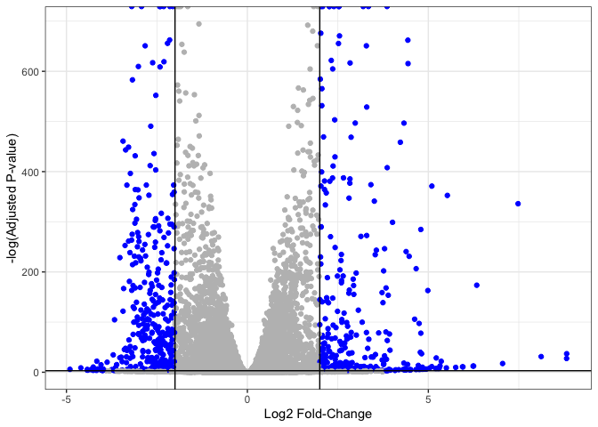

# Class 14:
Hailey Heirigs (PID: A16962278)

- [Required packages](#required-packages)
- [Data import](#data-import)
- [Remove zero count genes](#remove-zero-count-genes)
- [Set up DESeq object for analysis](#set-up-deseq-object-for-analysis)
- [Run DESeq analysis](#run-deseq-analysis)
- [Extract the results](#extract-the-results)
- [Add gene annotation](#add-gene-annotation)
- [Save my results to a CSV file](#save-my-results-to-a-csv-file)
- [Result visualization](#result-visualization)
- [Pathway analysis](#pathway-analysis)
- [Gene Ontology (GO)](#gene-ontology-go)
- [Reactome Analysis](#reactome-analysis)

Here we will perform a complete RNASeq analysis from courts to pathways
and biological interpretation.

The data for for hands-on session comes from GEO entry: GSE37704, which
is associated with the following publication:

Trapnell C, Hendrickson DG, Sauvageau M, Goff L et al. “Differential
analysis of gene regulation at transcript resolution with RNA-seq”. Nat
Biotechnol 2013 Jan;31(1):46-53. PMID: 23222703 The authors report on
differential analysis of lung fibroblasts in response to loss of the
developmental transcription factor HOXA1.

# Required packages

``` r
library(DESeq2)
library(AnnotationDbi)
library(org.Hs.eg.db)
library(pathview)
library(gage)
library(gageData)
```

# Data import

``` r
colData <- read.csv("GSE37704_metadata.csv", row.names = 1)
countData <- read.csv("GSE37704_featurecounts.csv", row.names = 1)
```

``` r
head(colData)
```

                  condition
    SRR493366 control_sirna
    SRR493367 control_sirna
    SRR493368 control_sirna
    SRR493369      hoxa1_kd
    SRR493370      hoxa1_kd
    SRR493371      hoxa1_kd

``` r
head(countData)
```

                    length SRR493366 SRR493367 SRR493368 SRR493369 SRR493370
    ENSG00000186092    918         0         0         0         0         0
    ENSG00000279928    718         0         0         0         0         0
    ENSG00000279457   1982        23        28        29        29        28
    ENSG00000278566    939         0         0         0         0         0
    ENSG00000273547    939         0         0         0         0         0
    ENSG00000187634   3214       124       123       205       207       212
                    SRR493371
    ENSG00000186092         0
    ENSG00000279928         0
    ENSG00000279457        46
    ENSG00000278566         0
    ENSG00000273547         0
    ENSG00000187634       258

Check the correspondance of colData rows and countData columns.

``` r
rownames(colData)
```

    [1] "SRR493366" "SRR493367" "SRR493368" "SRR493369" "SRR493370" "SRR493371"

Remove the troublesome first column so we match the metadata

``` r
counts <- countData[,-1]
```

``` r
head(counts)
```

                    SRR493366 SRR493367 SRR493368 SRR493369 SRR493370 SRR493371
    ENSG00000186092         0         0         0         0         0         0
    ENSG00000279928         0         0         0         0         0         0
    ENSG00000279457        23        28        29        29        28        46
    ENSG00000278566         0         0         0         0         0         0
    ENSG00000273547         0         0         0         0         0         0
    ENSG00000187634       124       123       205       207       212       258

``` r
all( rownames(colData) == colnames(counts) )
```

    [1] TRUE

# Remove zero count genes

We will have rows in `counts` for genes that we can not say anything
about becuase they have zero expression in the particular tissue we are
looking at.

``` r
head(counts)
```

                    SRR493366 SRR493367 SRR493368 SRR493369 SRR493370 SRR493371
    ENSG00000186092         0         0         0         0         0         0
    ENSG00000279928         0         0         0         0         0         0
    ENSG00000279457        23        28        29        29        28        46
    ENSG00000278566         0         0         0         0         0         0
    ENSG00000273547         0         0         0         0         0         0
    ENSG00000187634       124       123       205       207       212       258

If the `rowSums()` is zero, then give a gene (i.e. row) has no count
data and we should exclude these genes from further consideration.

``` r
to.keep <- rowSums(counts) != 0
cleancounts <- counts[to.keep,]
```

> Q. How many genes do we have left?

``` r
nrow(cleancounts)
```

    [1] 15975

# Set up DESeq object for analysis

``` r
dds <- DESeqDataSetFromMatrix(countData = cleancounts, 
                              colData = colData, 
                              design = ~condition)
```

    Warning in DESeqDataSet(se, design = design, ignoreRank): some variables in
    design formula are characters, converting to factors

# Run DESeq analysis

``` r
dds <- DESeq(dds)
```

    estimating size factors

    estimating dispersions

    gene-wise dispersion estimates

    mean-dispersion relationship

    final dispersion estimates

    fitting model and testing

# Extract the results

``` r
res <- results(dds)
head(res)
```

    log2 fold change (MLE): condition hoxa1 kd vs control sirna 
    Wald test p-value: condition hoxa1 kd vs control sirna 
    DataFrame with 6 rows and 6 columns
                     baseMean log2FoldChange     lfcSE       stat      pvalue
                    <numeric>      <numeric> <numeric>  <numeric>   <numeric>
    ENSG00000279457   29.9136      0.1792571 0.3248216   0.551863 5.81042e-01
    ENSG00000187634  183.2296      0.4264571 0.1402658   3.040350 2.36304e-03
    ENSG00000188976 1651.1881     -0.6927205 0.0548465 -12.630158 1.43989e-36
    ENSG00000187961  209.6379      0.7297556 0.1318599   5.534326 3.12428e-08
    ENSG00000187583   47.2551      0.0405765 0.2718928   0.149237 8.81366e-01
    ENSG00000187642   11.9798      0.5428105 0.5215599   1.040744 2.97994e-01
                           padj
                      <numeric>
    ENSG00000279457 6.86555e-01
    ENSG00000187634 5.15718e-03
    ENSG00000188976 1.76549e-35
    ENSG00000187961 1.13413e-07
    ENSG00000187583 9.19031e-01
    ENSG00000187642 4.03379e-01

# Add gene annotation

``` r
columns(org.Hs.eg.db)
```

     [1] "ACCNUM"       "ALIAS"        "ENSEMBL"      "ENSEMBLPROT"  "ENSEMBLTRANS"
     [6] "ENTREZID"     "ENZYME"       "EVIDENCE"     "EVIDENCEALL"  "GENENAME"    
    [11] "GENETYPE"     "GO"           "GOALL"        "IPI"          "MAP"         
    [16] "OMIM"         "ONTOLOGY"     "ONTOLOGYALL"  "PATH"         "PFAM"        
    [21] "PMID"         "PROSITE"      "REFSEQ"       "SYMBOL"       "UCSCKG"      
    [26] "UNIPROT"     

``` r
res$symbol = mapIds(org.Hs.eg.db,
                    keys=rownames(res), 
                    keytype="ENSEMBL",
                    column="SYMBOL",
                    multiVals="first")
```

    'select()' returned 1:many mapping between keys and columns

``` r
res$name <- mapIds(x=org.Hs.eg.db,
                     keys=rownames(res),
                     keytype = "ENSEMBL",
                     column = "GENENAME")
```

    'select()' returned 1:many mapping between keys and columns

``` r
res$entrez <- mapIds(x=org.Hs.eg.db,
                     keys=rownames(res),
                     keytype = "ENSEMBL",
                     column = "ENTREZID")
```

    'select()' returned 1:many mapping between keys and columns

``` r
head(res)
```

    log2 fold change (MLE): condition hoxa1 kd vs control sirna 
    Wald test p-value: condition hoxa1 kd vs control sirna 
    DataFrame with 6 rows and 9 columns
                     baseMean log2FoldChange     lfcSE       stat      pvalue
                    <numeric>      <numeric> <numeric>  <numeric>   <numeric>
    ENSG00000279457   29.9136      0.1792571 0.3248216   0.551863 5.81042e-01
    ENSG00000187634  183.2296      0.4264571 0.1402658   3.040350 2.36304e-03
    ENSG00000188976 1651.1881     -0.6927205 0.0548465 -12.630158 1.43989e-36
    ENSG00000187961  209.6379      0.7297556 0.1318599   5.534326 3.12428e-08
    ENSG00000187583   47.2551      0.0405765 0.2718928   0.149237 8.81366e-01
    ENSG00000187642   11.9798      0.5428105 0.5215599   1.040744 2.97994e-01
                           padj      symbol                   name      entrez
                      <numeric> <character>            <character> <character>
    ENSG00000279457 6.86555e-01          NA                     NA          NA
    ENSG00000187634 5.15718e-03      SAMD11 sterile alpha motif ..      148398
    ENSG00000188976 1.76549e-35       NOC2L NOC2 like nucleolar ..       26155
    ENSG00000187961 1.13413e-07      KLHL17 kelch like family me..      339451
    ENSG00000187583 9.19031e-01     PLEKHN1 pleckstrin homology ..       84069
    ENSG00000187642 4.03379e-01       PERM1 PPARGC1 and ESRR ind..       84808

# Save my results to a CSV file

``` r
write.csv(res, file="my_id_results.csv")
```

# Result visualization

``` r
mycols <- rep("grey", nrow(res))
mycols [ res$log2FoldChange <= -2 ] <- "blue"
mycols [ res$log2FoldChange >= +2 ] <- "blue"


mycols [ res$padj >= 0.05 ] <- "grey"
#mycols
plot(res$log2FoldChange, -log(res$padj), col=mycols)

abline(v=-2, col="red")
abline(v=+2, col="red")
abline(h=-log(0.005), col="red")
```


``` r
library(ggplot2)

ggplot(res) + 
  aes(log2FoldChange, -log(padj)) +
  geom_point(col=mycols) + 
  geom_vline(xintercept = c(-2, +2)) + 
  geom_hline(yintercept = -log(0.05)) + 
  theme_bw() + 
  labs(x="Log2 Fold-Change",
       y="-log(Adjusted P-value)")
```

    Warning: Removed 1237 rows containing missing values or values outside the scale range
    (`geom_point()`).



# Pathway analysis

``` r
library(gage)
library(gageData)
library(pathview)
```

``` r
data(kegg.sets.hs)
data(sigmet.idx.hs)

# Focus on signaling and metabolic pathways only
kegg.sets.hs = kegg.sets.hs[sigmet.idx.hs]

# Examine the first 3 pathways
head(kegg.sets.hs, 3)
```

    $`hsa00232 Caffeine metabolism`
    [1] "10"   "1544" "1548" "1549" "1553" "7498" "9"   

    $`hsa00983 Drug metabolism - other enzymes`
     [1] "10"     "1066"   "10720"  "10941"  "151531" "1548"   "1549"   "1551"  
     [9] "1553"   "1576"   "1577"   "1806"   "1807"   "1890"   "221223" "2990"  
    [17] "3251"   "3614"   "3615"   "3704"   "51733"  "54490"  "54575"  "54576" 
    [25] "54577"  "54578"  "54579"  "54600"  "54657"  "54658"  "54659"  "54963" 
    [33] "574537" "64816"  "7083"   "7084"   "7172"   "7363"   "7364"   "7365"  
    [41] "7366"   "7367"   "7371"   "7372"   "7378"   "7498"   "79799"  "83549" 
    [49] "8824"   "8833"   "9"      "978"   

    $`hsa00230 Purine metabolism`
      [1] "100"    "10201"  "10606"  "10621"  "10622"  "10623"  "107"    "10714" 
      [9] "108"    "10846"  "109"    "111"    "11128"  "11164"  "112"    "113"   
     [17] "114"    "115"    "122481" "122622" "124583" "132"    "158"    "159"   
     [25] "1633"   "171568" "1716"   "196883" "203"    "204"    "205"    "221823"
     [33] "2272"   "22978"  "23649"  "246721" "25885"  "2618"   "26289"  "270"   
     [41] "271"    "27115"  "272"    "2766"   "2977"   "2982"   "2983"   "2984"  
     [49] "2986"   "2987"   "29922"  "3000"   "30833"  "30834"  "318"    "3251"  
     [57] "353"    "3614"   "3615"   "3704"   "377841" "471"    "4830"   "4831"  
     [65] "4832"   "4833"   "4860"   "4881"   "4882"   "4907"   "50484"  "50940" 
     [73] "51082"  "51251"  "51292"  "5136"   "5137"   "5138"   "5139"   "5140"  
     [81] "5141"   "5142"   "5143"   "5144"   "5145"   "5146"   "5147"   "5148"  
     [89] "5149"   "5150"   "5151"   "5152"   "5153"   "5158"   "5167"   "5169"  
     [97] "51728"  "5198"   "5236"   "5313"   "5315"   "53343"  "54107"  "5422"  
    [105] "5424"   "5425"   "5426"   "5427"   "5430"   "5431"   "5432"   "5433"  
    [113] "5434"   "5435"   "5436"   "5437"   "5438"   "5439"   "5440"   "5441"  
    [121] "5471"   "548644" "55276"  "5557"   "5558"   "55703"  "55811"  "55821" 
    [129] "5631"   "5634"   "56655"  "56953"  "56985"  "57804"  "58497"  "6240"  
    [137] "6241"   "64425"  "646625" "654364" "661"    "7498"   "8382"   "84172" 
    [145] "84265"  "84284"  "84618"  "8622"   "8654"   "87178"  "8833"   "9060"  
    [153] "9061"   "93034"  "953"    "9533"   "954"    "955"    "956"    "957"   
    [161] "9583"   "9615"  

``` r
foldchanges = res$log2FoldChange
names(foldchanges) = res$entrez
head(foldchanges)
```

           <NA>      148398       26155      339451       84069       84808 
     0.17925708  0.42645712 -0.69272046  0.72975561  0.04057653  0.54281049 

``` r
# Get the results
keggres = gage(foldchanges, gsets=kegg.sets.hs)
```

``` r
attributes(keggres)
```

    $names
    [1] "greater" "less"    "stats"  

``` r
# Look at the first few down (less) pathways
head(keggres$less)
```

                                             p.geomean stat.mean        p.val
    hsa04110 Cell cycle                   8.995727e-06 -4.378644 8.995727e-06
    hsa03030 DNA replication              9.424076e-05 -3.951803 9.424076e-05
    hsa03013 RNA transport                1.246882e-03 -3.059466 1.246882e-03
    hsa03440 Homologous recombination     3.066756e-03 -2.852899 3.066756e-03
    hsa04114 Oocyte meiosis               3.784520e-03 -2.698128 3.784520e-03
    hsa00010 Glycolysis / Gluconeogenesis 8.961413e-03 -2.405398 8.961413e-03
                                                q.val set.size         exp1
    hsa04110 Cell cycle                   0.001448312      121 8.995727e-06
    hsa03030 DNA replication              0.007586381       36 9.424076e-05
    hsa03013 RNA transport                0.066915974      144 1.246882e-03
    hsa03440 Homologous recombination     0.121861535       28 3.066756e-03
    hsa04114 Oocyte meiosis               0.121861535      102 3.784520e-03
    hsa00010 Glycolysis / Gluconeogenesis 0.212222694       53 8.961413e-03

``` r
pathview(gene.data=foldchanges, pathway.id="hsa04110")
```

    'select()' returned 1:1 mapping between keys and columns

    Info: Working in directory /Users/haileyheirigs/Desktop/BIMM143.r-work/bimm143_github/class14

    Info: Writing image file hsa04110.pathview.png

``` r
# A different PDF based output of the same data
pathview(gene.data=foldchanges, pathway.id="hsa04110", kegg.native=FALSE)
```

    'select()' returned 1:1 mapping between keys and columns

    Warning: reconcile groups sharing member nodes!

         [,1] [,2] 
    [1,] "9"  "300"
    [2,] "9"  "306"

    Info: Working in directory /Users/haileyheirigs/Desktop/BIMM143.r-work/bimm143_github/class14

    Info: Writing image file hsa04110.pathview.pdf

``` r
## Focus on top 5 upregulated pathways here for demo purposes only
keggrespathways <- rownames(keggres$greater)[1:5]

# Extract the 8 character long IDs part of each string
keggresids = substr(keggrespathways, start=1, stop=8)
keggresids
```

    [1] "hsa04640" "hsa04630" "hsa00140" "hsa04142" "hsa04330"

``` r
pathview(gene.data=foldchanges, pathway.id=keggresids, species="hsa")
```

    'select()' returned 1:1 mapping between keys and columns

    Info: Working in directory /Users/haileyheirigs/Desktop/BIMM143.r-work/bimm143_github/class14

    Info: Writing image file hsa04640.pathview.png

    'select()' returned 1:1 mapping between keys and columns

    Info: Working in directory /Users/haileyheirigs/Desktop/BIMM143.r-work/bimm143_github/class14

    Info: Writing image file hsa04630.pathview.png

    'select()' returned 1:1 mapping between keys and columns

    Info: Working in directory /Users/haileyheirigs/Desktop/BIMM143.r-work/bimm143_github/class14

    Info: Writing image file hsa00140.pathview.png

    'select()' returned 1:1 mapping between keys and columns

    Info: Working in directory /Users/haileyheirigs/Desktop/BIMM143.r-work/bimm143_github/class14

    Info: Writing image file hsa04142.pathview.png

    'select()' returned 1:1 mapping between keys and columns

    Info: Working in directory /Users/haileyheirigs/Desktop/BIMM143.r-work/bimm143_github/class14

    Info: Writing image file hsa04330.pathview.png

# Gene Ontology (GO)

``` r
data(go.sets.hs)
data(go.subs.hs)

# Focus on Biological Process subset of GO
gobpsets = go.sets.hs[go.subs.hs$BP]

gobpres = gage(foldchanges, gsets=gobpsets, same.dir=TRUE)

lapply(gobpres, head)
```

    $greater
                                                 p.geomean stat.mean        p.val
    GO:0007156 homophilic cell adhesion       8.519724e-05  3.824205 8.519724e-05
    GO:0002009 morphogenesis of an epithelium 1.396681e-04  3.653886 1.396681e-04
    GO:0048729 tissue morphogenesis           1.432451e-04  3.643242 1.432451e-04
    GO:0007610 behavior                       1.925222e-04  3.565432 1.925222e-04
    GO:0060562 epithelial tube morphogenesis  5.932837e-04  3.261376 5.932837e-04
    GO:0035295 tube development               5.953254e-04  3.253665 5.953254e-04
                                                  q.val set.size         exp1
    GO:0007156 homophilic cell adhesion       0.1951953      113 8.519724e-05
    GO:0002009 morphogenesis of an epithelium 0.1951953      339 1.396681e-04
    GO:0048729 tissue morphogenesis           0.1951953      424 1.432451e-04
    GO:0007610 behavior                       0.1967577      426 1.925222e-04
    GO:0060562 epithelial tube morphogenesis  0.3565320      257 5.932837e-04
    GO:0035295 tube development               0.3565320      391 5.953254e-04

    $less
                                                p.geomean stat.mean        p.val
    GO:0048285 organelle fission             1.536227e-15 -8.063910 1.536227e-15
    GO:0000280 nuclear division              4.286961e-15 -7.939217 4.286961e-15
    GO:0007067 mitosis                       4.286961e-15 -7.939217 4.286961e-15
    GO:0000087 M phase of mitotic cell cycle 1.169934e-14 -7.797496 1.169934e-14
    GO:0007059 chromosome segregation        2.028624e-11 -6.878340 2.028624e-11
    GO:0000236 mitotic prometaphase          1.729553e-10 -6.695966 1.729553e-10
                                                    q.val set.size         exp1
    GO:0048285 organelle fission             5.841698e-12      376 1.536227e-15
    GO:0000280 nuclear division              5.841698e-12      352 4.286961e-15
    GO:0007067 mitosis                       5.841698e-12      352 4.286961e-15
    GO:0000087 M phase of mitotic cell cycle 1.195672e-11      362 1.169934e-14
    GO:0007059 chromosome segregation        1.658603e-08      142 2.028624e-11
    GO:0000236 mitotic prometaphase          1.178402e-07       84 1.729553e-10

    $stats
                                              stat.mean     exp1
    GO:0007156 homophilic cell adhesion        3.824205 3.824205
    GO:0002009 morphogenesis of an epithelium  3.653886 3.653886
    GO:0048729 tissue morphogenesis            3.643242 3.643242
    GO:0007610 behavior                        3.565432 3.565432
    GO:0060562 epithelial tube morphogenesis   3.261376 3.261376
    GO:0035295 tube development                3.253665 3.253665

# Reactome Analysis

We need to make a little file of our significant genes that we can
upload to the reactome webpage:

``` r
sig_genes <- res[res$padj <= 0.05 & !is.na(res$padj), "symbol"]
print(paste("Total number of significant genes:", length(sig_genes)))
```

    [1] "Total number of significant genes: 8147"

``` r
write.table(sig_genes, file="significant_genes.txt", row.names=FALSE, col.names=FALSE, quote=FALSE)
```

Then, to perform pathway analysis online go to the Reactome website
(https://reactome.org/PathwayBrowser/#TOOL=AT). Select “choose file” to
upload your significant gene list. Then, select the parameters “Project
to Humans”, then click “Analyze”.


